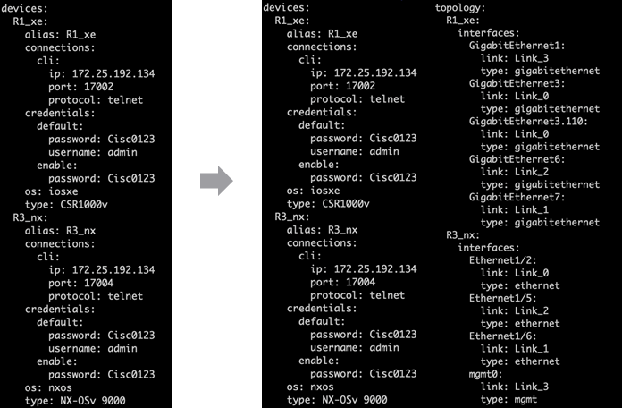
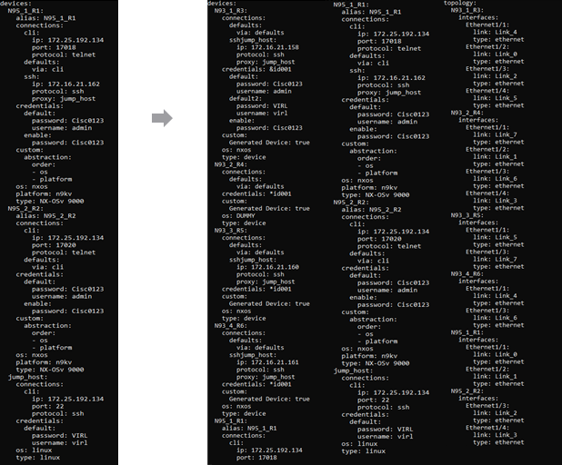
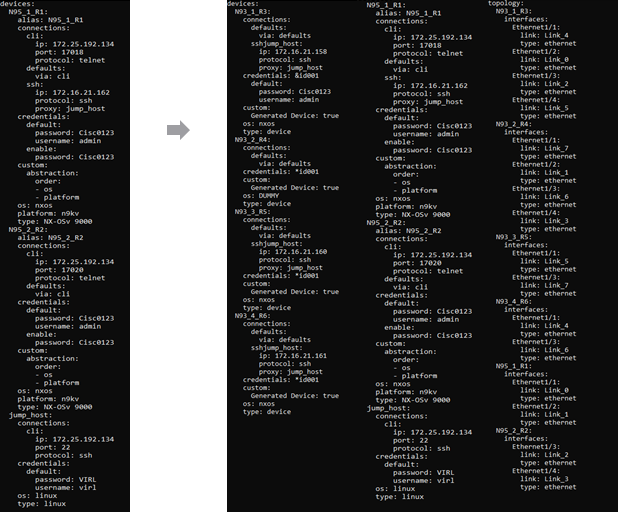

# This is in BETA mode - Only use this on your lab devices
# Device Discovery

*pyATS create testbed topology* takes a testbed yaml file provided by the user that contains at least one device that can be connected to and then the creator will discover all the devices and device connections using CDP and LLDP  and then return the information in a new  testbed yaml file. The script also contains a mode that avoids discovering new devices and just reports connections between the devices already in the testbed. 

**Note**: Topology creator can be allowed to change configuration of devices CDP and LLDP protocols if it is important that those configurations remain unchanged make sure to not enable config-discovery

The topology creator also has a variety of options as listed below
- config-discovery: Option to allow creator to configure a devices CDP and LLDP

- add-unconnected-interfaces: Normal behavior for script is to only add interfaces with active connections to topology, this will add all of a devices' interfaces regardless of connection status

- exclude-networks: List ip ranges in form of #.#.#.#/# . Any connection that has an ip address falling in that range will not be added to the topology

- exclude-interfaces: List interface names that if found in a connection, the creator will skip that connection and not add it to the topology

- only-links: If this is flagged the creator will only discover links between devices on the testbed, it won't do any device discovery

- alias: Takes argument in format device:alias device2:alias2  and indicates which alias should be used to connect to the device first, default behavior has no prefered alias

- ssh-only: If True the script will only attempt to use ssh connections to connect to devices, default behavior is to use all connections

- timeout: How long before connection and verification attempts time out. Default value is 10 seconds

- universal-login: give a set of credentials in format 'username' 'password' that will be used to connect to any new devices

- cred-prompt: If flagged, the creator will prompt you to add the username and password for any device that's discovered

- debug-log: Name of debug log to be generated, the log generated will contain more info than just what is sent to the console

- disable-config: If true, the script will not run config commands on devices that it connects to

- telnet-connect: Create connection to new devices as telnet connections instead of ssh connections

## Examples
### Discovering only Links Between Existing Devices
By staring with a testbed file and running the following command:

    pyats create testbed topology --testbed-file <testbed-name>.yaml --output result.yaml --only-links
    .......
    2020-08-13T14:56:06: %CONTRIB-INFO: Testbed file generated:
    2020-08-13T14:56:06: %CONTRIB-INFO: result.yaml
This will take the initial testbed yaml file and generate a new yaml file called result.yaml with the originals information with the topology information added on

### Device Discovery:
By default the topology creator will search for new devices and add them to the  testbed

    pyats create testbed topology --testbed-file <testbed-name>.yaml --output result.yaml
    .......
    2020-08-13T14:56:06: %CONTRIB-INFO: Testbed file generated:
    2020-08-13T14:56:06: %CONTRIB-INFO: result.yaml
This will generate a new testbed with the newly discovered devices added in

### Device Discovery with user input options:
With these flages enabled it will allow the system to enable CDP and LLDP on devices to make sure the creator finds all connections on the devices. Also enabled is manual credential entry and creation of a debug log

    pyats create testbed topology --testbed-file <testbed-name>.yaml --output result.yaml --config-discovery --cred-prompt --debug-log debug.log
    
    Running creator with config-discovery will reset cdp and lldp configuration to basic configuration is this acceptable (y/n) y
    .......
    Enter username to connect to device N93_1_R3: admin
    Enter password to connect to device N93_1_R3:
    Enter username to connect to device N93_2_R4: admin
    Enter password to connect to device N93_2_R4:
    .......
    Enter username to connect to device N93_4_R6: admin
    Enter password to connect to device N93_4_R6:
    Enter username to connect to device N93_3_R5: admin
    Enter password to connect to device N93_3_R5:
    .......
    2020-08-13T14:56:06: %CONTRIB-INFO: Debug log generated: debug.log
    2020-08-13T14:56:06: %CONTRIB-INFO: Testbed file generated:
    2020-08-13T14:56:06: %CONTRIB-INFO: result.yaml

## Continuing Work

### Existing Limitations
- Arguments with - need to be assigned to argument with equal sign EX: 

        --testbed-file test-bed.yaml 
    will not work, but 
    
        --testbed-file=test-bed.yaml 
    will work

- if the script finds numerous IP addresses to connect to a device it will attempt to connect with all of them, this can lead to long amounts of time spent connecting to devices
- exclude networks is only tested to work with ipV4 addresses, no data for performance with ipV6 addreses is known
- Can use devices with only telnet connections as proxies
- Script has only been tested  to work with devices that have telnet and ssh connections
- Arguments need to be entered with spaces int them need to have ' ' surounding them IE: 
        
        --exlcude-interfaces arg1 arg2
    will only parse arg1 while

        --exclude-interfaces 'arg1 arg2'
    will parse both
- Script will not find IPv6 address for interfaces
- Script will not retest devices after one set of connection attempts (IE if correct connection info for a device after it's connection attenpt, it won't be used)
- If the script sees an IP address listed as an interface address and a mgmt address, it will treat it as a mgmt ip address only
- currently parsers tend to report most ip addresss found as mgmt addresses even if they are not so alot of interface addresses are falsely reported as mgmt addresses

### Further testing required for features
- add-unconnected-interfaces
- disable-config
- telnet-connect
- exclude-networks (with IPv6 networks)
- timeout
- Test on physical devices
- ssh-only in conjunction with telnet-connection
- performance with low timeout times
- performance with making connections interface ip addresses
- Test on devices without telnet and ssh connections 

### To Develop (not needed)
- make code compatible for working with IPv6 addresses (edit apis to get IPv6 Address for interfaces and)
- Find way to make connection attempts faster (currently the script has to destroy the connection after each connection attempt and that adds alot of time)
